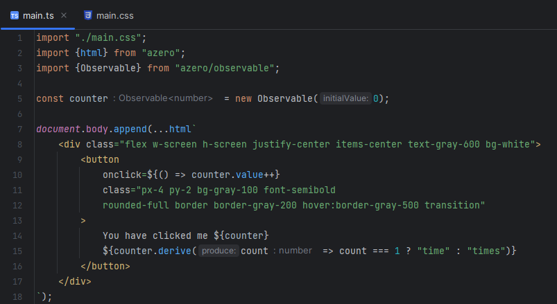

# azero



A lightweight front-end JavaScript framework with built-in state management. The syntax is similar to [htm](https://github.com/developit/htm) used with [vhtml](https://github.com/developit/vhtml) but without the step of transforming it into a tree. 

`azero` uses [tagged templates](https://developer.mozilla.org/en-US/docs/Web/JavaScript/Reference/Template_literals#tagged_templates) and works in any modern browser.

## Features

> A _primitive_ is a `string`, `number`, `symbol`, `boolean`, `undefined` or `null`.

- Optional quotes: `<div a="0" b='1' c=2></div>`
- Self-closing tags: `<div/>`
- Void tags: ``
- Components: `<${Foo}></${Foo}>` or `<${Foo}><//>` where `Foo` is a function that returns `Node[]` or `Node`
- Spread props: `<div ...${props}>`
- Insert any `<div>${content}</div>` where `content` is:
  - a primitive
  - a `Node`
  - a `Node[]`
  - an `Observable<primitive>`
  - an `Observable<Node>`
  - an `Observable<Node[]>`
- Reactive attributes (on native elements) `<div title=${title}></div>` where `title` is:
  - a `primitive`
  - an `Observable<primitive>`
- Reactive string attributes (on native elements) `<div class="${value} bg-gray-200">content</div>` where `value` is:
  - a primitive
  - an `Observable<primitive>`

## Upcoming

## Installation

```shell
npm i azero

pnpm i azero
```