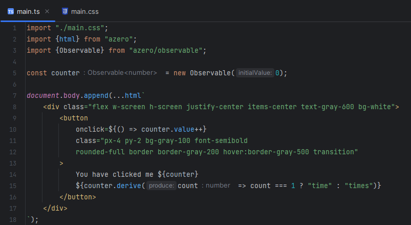

# azero



A lightweight front-end JavaScript framework with built-in state management. The syntax is similar to [htm](https://github.com/developit/htm) used with [vhtml](https://github.com/developit/vhtml) but without the step of transforming it into a tree. 

`azero` uses [tagged templates](https://developer.mozilla.org/en-US/docs/Web/JavaScript/Reference/Template_literals#tagged_templates) and works in any modern browser.

## Features

- Self-closing tags: `<div/>`
- Components: `<${Foo}></${Foo}>` where `Foo` is a function that returns `Node[]`

## Upcoming Features (Not Implemented Yet)

- Void tags: ``
- Component end-tags: `<${Foo}><//>`
- Spread props: `<div ...${props}`>

## Installation

```shell
npm i azero

pnpm i azero
```